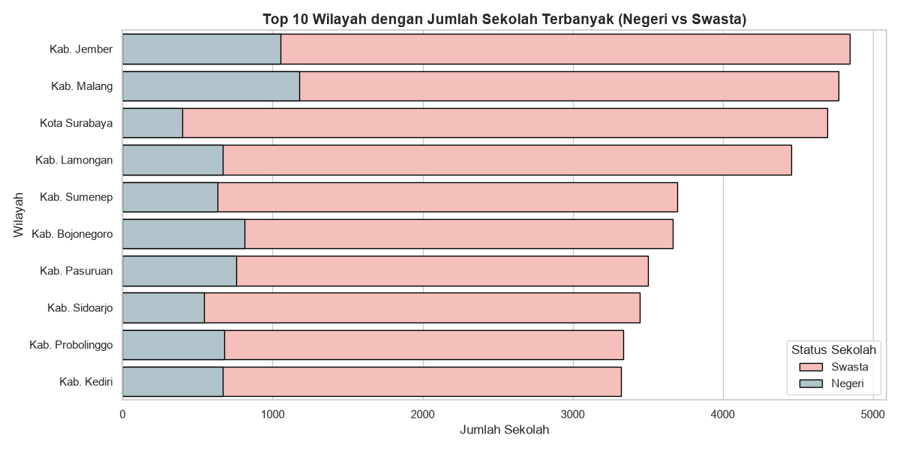
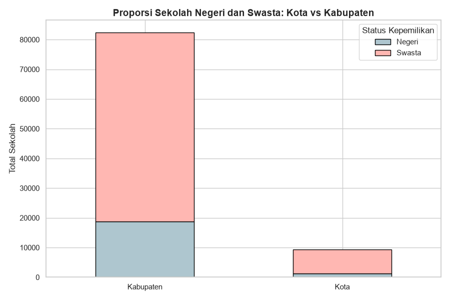
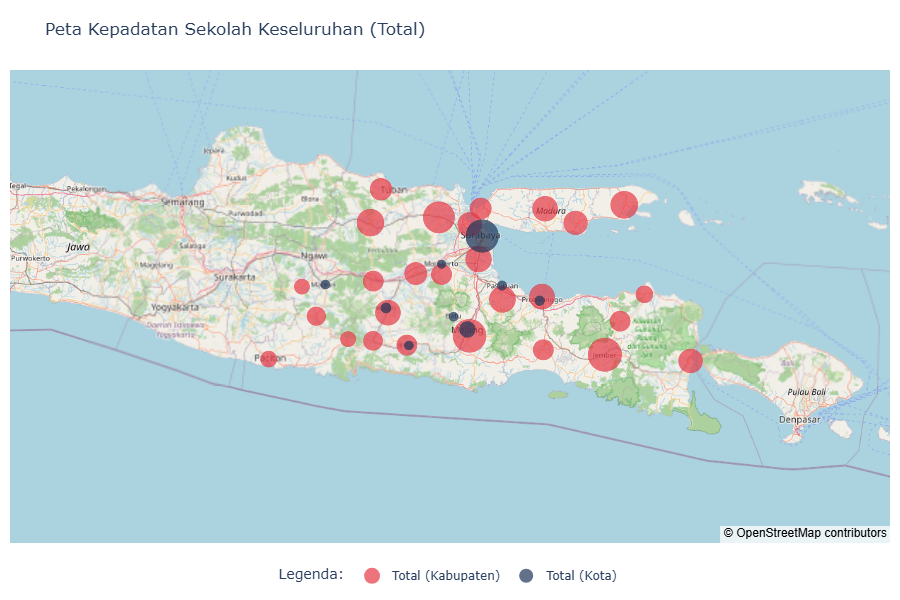
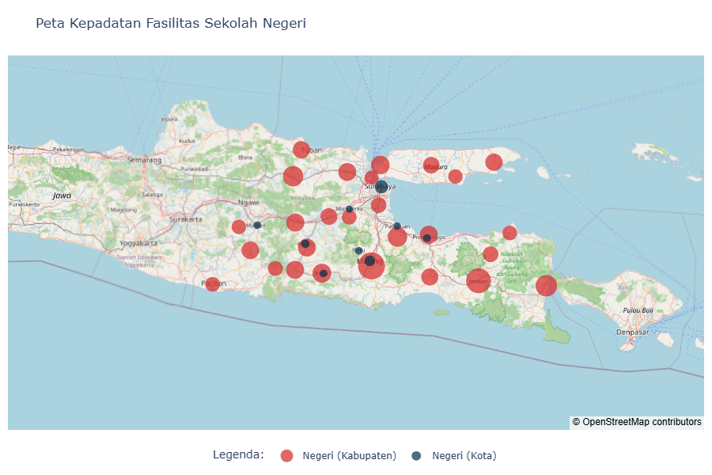
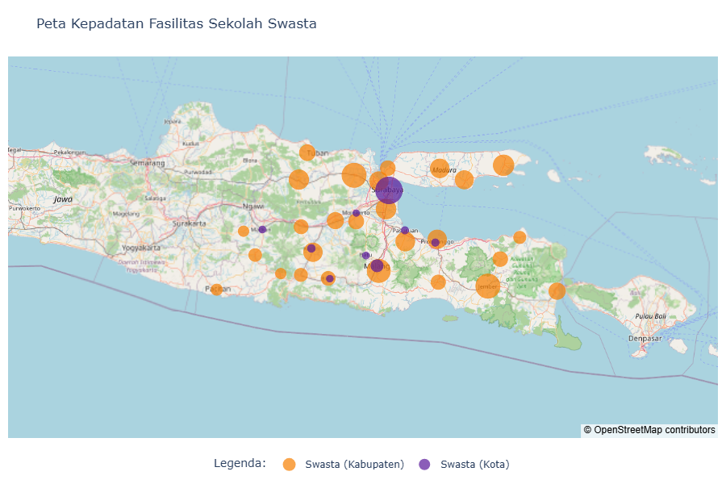
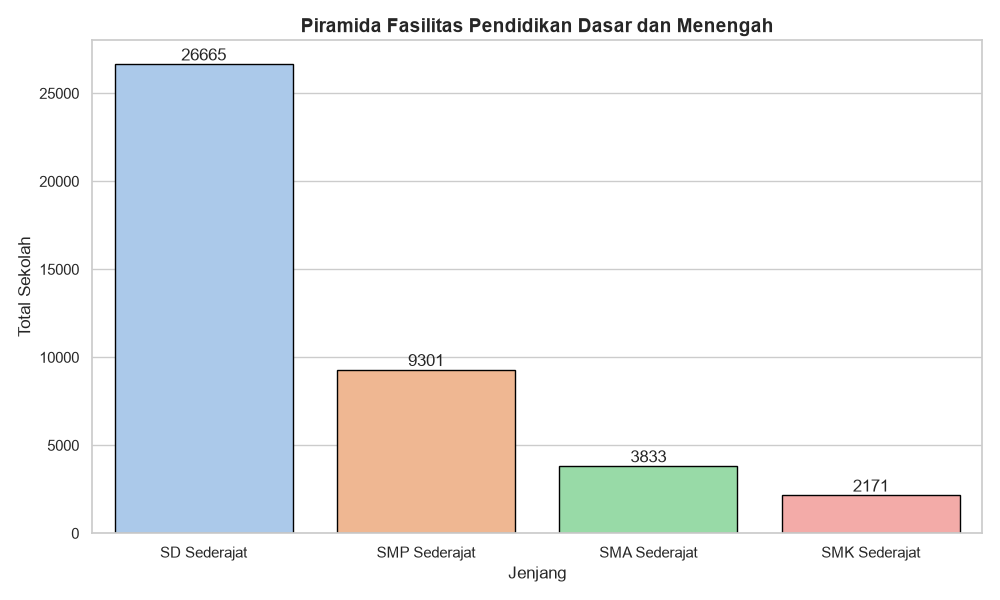
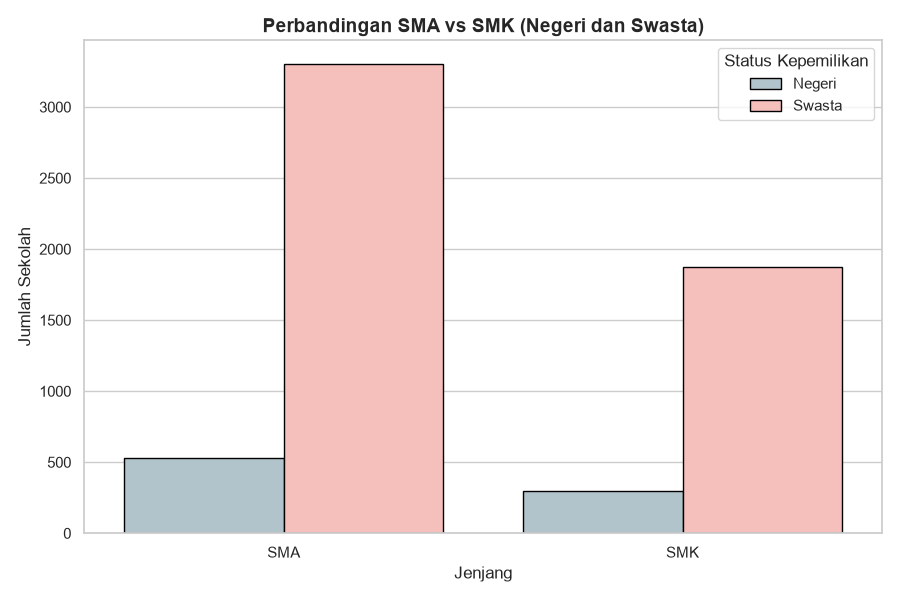

# SchoolSpatial on East Java 🏫🗺️

## Deskripsi Proyek
**SchoolSpatial on East Java** adalah platform analisis berbasis data dan geospasial yang memvisualisasikan serta mengevaluasi distribusi fasilitas pendidikan di seluruh wilayah Jawa Timur. Proyek ini bertujuan untuk memetakan infrastruktur pendidikan guna mengevaluasi aksesibilitas, melihat dominasi sektor (Negeri vs Swasta), serta menemukan kemungkinan adanya kesenjangan (*bottleneck*) dalam sistem kelanjutan pendidikan.

## Alur Kerja (Workflow) Singkat
1. **Data Collection**: Mengunduh data mentah infrastruktur sekolah (SD, SMP, SMA, SMK, dll., baik Negeri maupun Swasta) dari portal resmi Kemendikdasmen.
2. **Data Preprocessing**: Membersihkan data (*data cleaning*), merapikan penamaan wilayah, serta mengategorikan wilayah administratif ke dalam "Kabupaten" atau "Kota".
3. **Data Aggregation**: Menggabungkan (*merge*) data Negeri dan Swasta, lalu menghitung metrik total keseluruhan untuk masing-masing tingkat pendidikan.
4. **Data Visualization**: Mengekstraksi *insight* dengan membangun berbagai grafik analitik (Bar Chart, Grouped Chart, Pyramid Chart) menggunakan Matplotlib dan Seaborn.
5. **Geospatial Mapping**: Melakukan *mapping* titik koordinat pada peta menggunakan Plotly Mapbox untuk menghasilkan visualisasi kepadatan interaktif yang **berwarna (tidak hitam-putih)** berdasarkan klasifikasi wilayah.

## 🗄️ Sumber Data
Dataset yang digunakan pada proyek ini bersumber secara orisinal dan valid dari:
* **Portal Resmi**: [Data Pokok Pendidikan (Dapodik) Kemendikdasmen](https://data.kemendikdasmen.go.id/data-induk/satpen)
* **Cakupan Data**: Provinsi Jawa Timur (terbaru per 03 Agustus 2026).

---

## Laporan Output Analisis (Report)

Berikut adalah laporan runut dan detail dari setiap temuan yang dihasilkan pada *notebook* `Analisis 2.0.ipynb`:

### 1. Distribusi Total Sekolah (Top 10 Wilayah)
Menampilkan 10 wilayah di Jawa Timur dengan jumlah sekolah (gabungan Negeri & Swasta) paling banyak. 

* **Insight Terpenting**: Kabupaten Sidoarjo, Kabupaten Bojonegoro, dan Kabupaten Gresik muncul sebagai pusat kepadatan infrastruktur terbanyak secara kuantitas. Pada wilayah-wilayah ini juga terlihat bahwa porsi sumbangsih sekolah swasta hampir menyamai atau melampaui negeri.

### 2. Komparasi Karakteristik Wilayah: Kota vs Kabupaten
Membandingkan secara proporsional sebaran sekolah Negeri dan Swasta berdasarkan tipe wilayah administratifnya.

* **Insight Terpenting**: Terdapat perbedaan karakteristik demografi pendidikan yang sangat kontras. Di area **Kota**, sekolah Swasta sangat mendominasi ketersediaan fasilitas. Sebaliknya, di area **Kabupaten** (pedesaan/pinggiran), sekolah Negeri memegang peranan kunci, membuktikan upaya pemerintah dalam menjamin ketersediaan fasilitas dasar bagi penduduk rural.

### 3. Peta Geospasial Kepadatan Sekolah (Colored Mapbox)
Memvisualisasikan titik kumpul dan kepadatan sekolah pada peta satelit/peta dasar. Tiap peta diproses menggunakan *Bubble Map* dengan variasi **warna penuh** yang tegas (bukan map hitam-putih atau sekadar garis) agar pembaca dapat langsung membedakan *Kabupaten* dan *Kota*.

* **Peta 4.1 (Kepadatan Keseluruhan)**: Kabupaten menggunakan *bubble* **Merah**, Kota berwarna **Biru**.

* **Peta 4.2 (Fasilitas Negeri)**: Kabupaten berwarna **Merah Gelap**, Kota berwarna **Biru Gelap**.

* **Peta 4.3 (Fasilitas Swasta)**: Kabupaten berwarna **Oranye**, Kota berwarna **Ungu**.

* **Insight Terpenting**: Pemusatan infrastruktur terpusat secara masif di area aglomerasi Surabaya Raya (Surabaya, Sidoarjo, Gresik) dan Malang Raya. Peta sekolah swasta menunjukkan titik-titik (bubble) yang sangat besar khusus di sekitar wilayah perkotaan tersebut.

### 4. Piramida Tingkat Pendidikan
Membandingkan total penyediaan fasilitas SD, SMP, SMA, dan SMK secara keseluruhan se-Jawa Timur.

* **Insight Terpenting**: Grafik menunjukkan pengerucutan atau penyusutan jumlah fasilitas yang drastis dari jenjang SD menuju SMP, serta dari SMP menuju jenjang lanjutan atas. Ini mengisyaratkan tingginya beban daya tampung sekolah lanjutan.

### 5. Fokus Vokasi (Komparasi SMA vs SMK)
Perbandingan fasilitas SMA (Akademik) melawan SMK (Vokasi), yang diklasifikasikan lagi berdasarkan status kepemilikan Negeri atau Swasta.

* **Insight Terpenting**: Ketersediaan institusi SMK Swasta luar biasa tinggi, jauh melampaui jumlah SMA Swasta, SMA Negeri, dan SMK Negeri. Ini membuktikan sektor swasta merespons secara agresif tingginya minat masyarakat terhadap pendidikan vokasi/keahlian siap kerja.

### 6. Analisis *Bottleneck* (Rasio SD ke Lanjutan)
Penjabaran metrik rasio yang menghitung persis berapa angka perbandingan antara sekolah tingkat bawah dengan tingkat lanjut di atasnya.
* **Insight Terpenting**: Hasil angka menunjukkan ketimpangan rasio (satu gedung SMP dituntut untuk menampung murid lulusan dari beberapa gedung SD sekaligus). Angka ini dapat menjadi acuan konkret bagi pemerintah (*policymakers*) dalam menentukan wilayah mana yang butuh tambahan gedung SMP/SMA negeri baru.

---